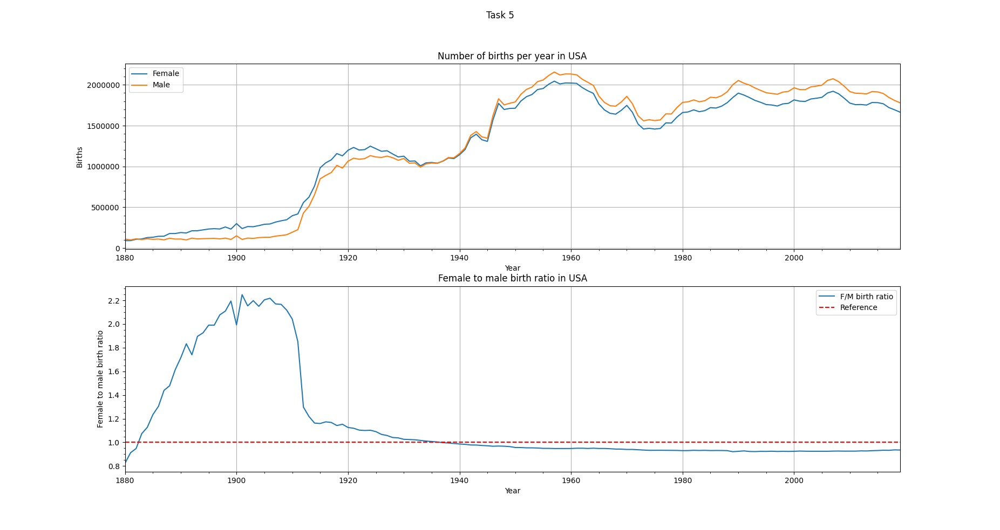
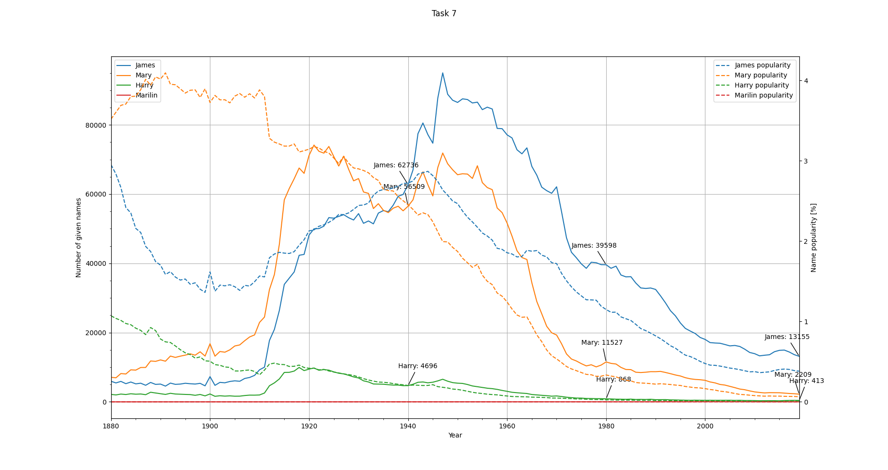
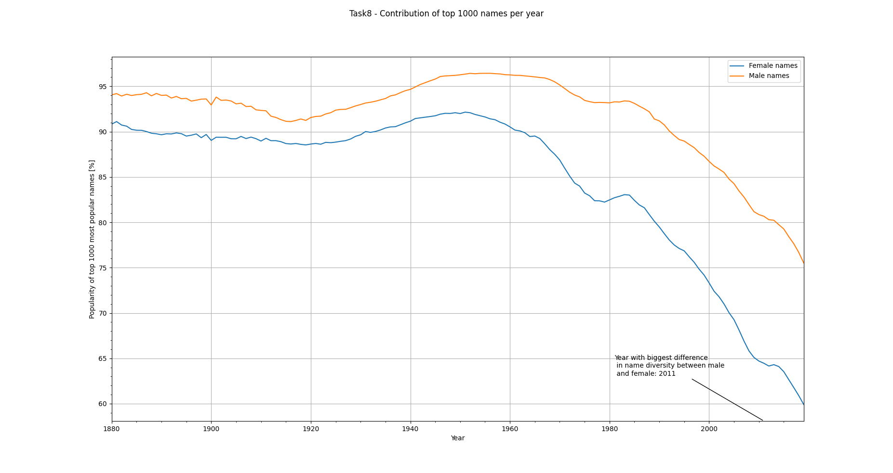
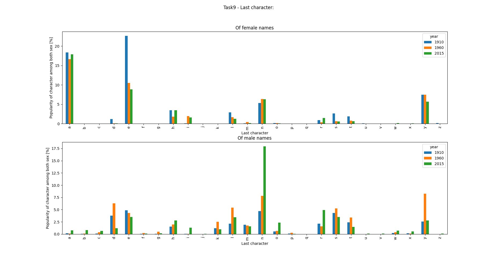
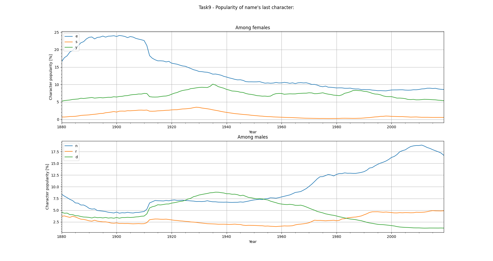
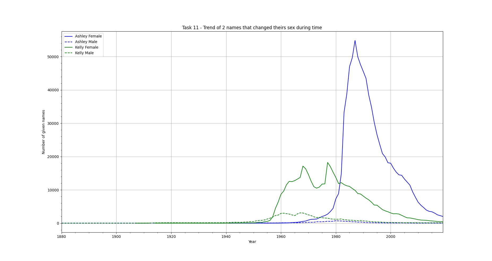
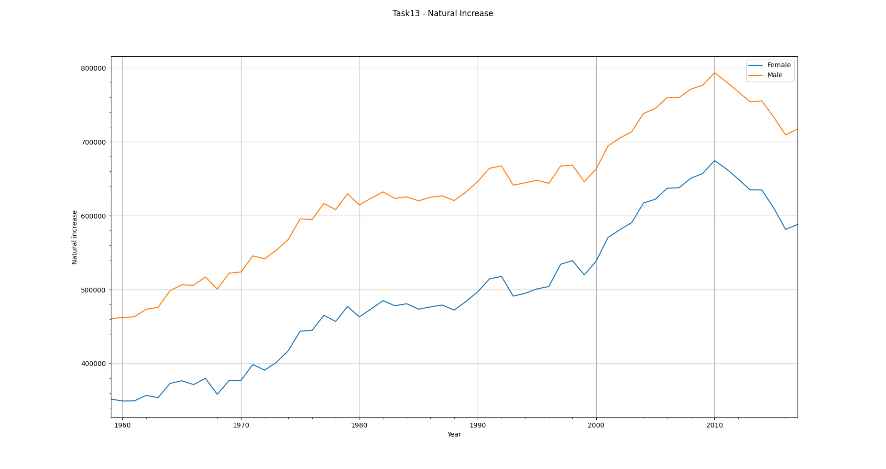
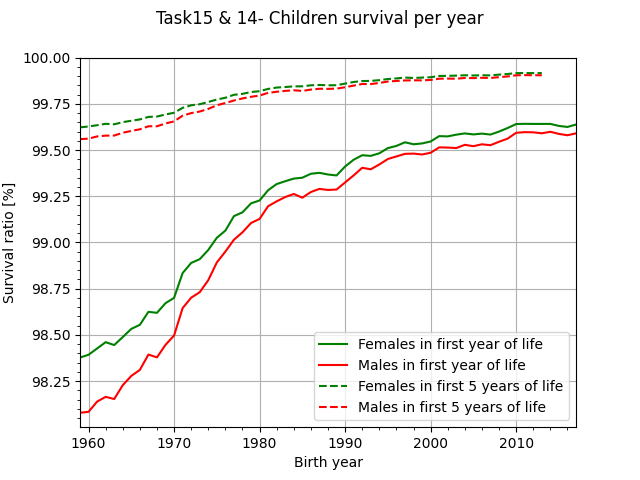

# USA population analysis
Mini Project for Data Science course @ Poznan University of Technology, Institute of Robotics and Machine Intelligence. The goal of the project was to consolidate the knowledge about downloading data, loading data and usage of Pandas library.

The data was provided by the lecturer and comes from USA's Social Security Administration. It contains frequency of names through 1880-2019.
The second part of data contained mortality of USA population through 1959-2018r. and comes from mortality.org

## Project requirements:
- only one .py script 
- input files given by relative path directly from working directory

## Requirements:
- python 3.8
- see `requirements.txt`

## Charts

